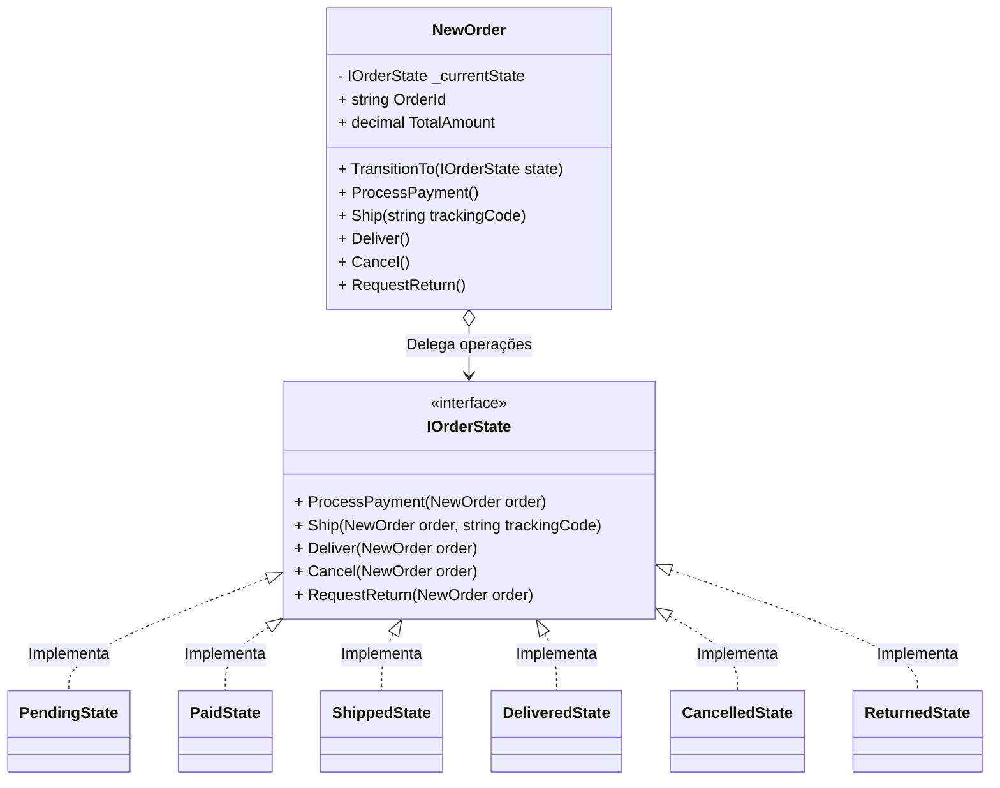

## 🥁 CarnaCode 2026 - Desafio 20 - State

Oi, eu sou o Ronaldo e este é o espaço onde compartilho minha jornada de aprendizado durante o desafio **CarnaCode 2026**, realizado pelo [balta.io](https://balta.io). 👻

Aqui você vai encontrar projetos, exercícios e códigos que estou desenvolvendo durante o desafio. O objetivo é colocar a mão na massa, testar ideias e registrar minha evolução no mundo da tecnologia.

### Sobre este desafio
No desafio **State** eu tive que resolver um problema real implementando o **Design Pattern** em questão.
Neste processo eu aprendi:
* ✅ Boas Práticas de Software
* ✅ Código Limpo
* ✅ SOLID
* ✅ Design Patterns (Padrões de Projeto)

## Problema
Um pedido passa por múltiplos estados (Pendente, Pago, Enviado, Entregue, Cancelado) e cada estado permite operações diferentes. O código atual usa condicionais gigantes que verificam o estado atual antes de cada operação, tornando difícil adicionar novos estados.

## Solução com o Padrão State
O padrão **State** foi aplicado para encapsular os comportamentos específicos de cada estado em classes separadas. Em vez de a classe de contexto usar instruções *switch* enormes para decidir o que fazer com base no seu estado, ela delega a execução para o seu objeto de estado atual.
Isso promove o Princípio da Responsabilidade Única (SRP) e o Princípio Aberto/Fechado (OCP), pois novos estados podem ser adicionados sem alterar o contexto ou as classes de estado existentes.

### Etapas de Refatoração
A refatoração iterativa consistiu nos seguintes passos:
1. **Configuração Inicial:** Criação do arquivo `.csproj` (Target .NET 10) garantindo uma compilação isolada para o projeto.
2. **Interface de Estado:** Criação da interface base `IOrderState.cs` definindo o contrato das operações possíveis nos estados (`ProcessPayment`, `Ship`, `Deliver`, `Cancel`, `RequestReturn`).
3. **Contexto:** Implementação da classe `NewOrder.cs` mantendo uma referência para a interface base de estado e delegando as execuções para o estado atual.
4. **Estados Concretos:** Implementação das 6 classes de estado em arquivos separados na pasta `src/States` (`PendingState`, `PaidState`, `ShippedState`, `DeliveredState`, `CancelledState`, `ReturnedState`).
5. **Demonstração:** Desenvolvimento do `Program.cs` com dupla execução (código legado x código com design pattern) provando a mesma lógica, porém com uma manutenibilidade infinitamente melhor.

### Estrutura do Projeto
```text
📦 balta-desafio-carnacode-2026_20-state
┣ 📂 src
┃ ┣ 📂 States
┃ ┃ ┣ 📜 CancelledState.cs
┃ ┃ ┣ 📜 DeliveredState.cs
┃ ┃ ┣ 📜 PaidState.cs
┃ ┃ ┣ 📜 PendingState.cs
┃ ┃ ┣ 📜 ReturnedState.cs
┃ ┃ ┗ 📜 ShippedState.cs
┃ ┣ 📜 Challenge.cs (Sistema Legado)
┃ ┣ 📜 IOrderState.cs (Interface)
┃ ┣ 📜 NewOrder.cs (Contexto)
┃ ┣ 📜 Program.cs (Ponto de entrada demonstrativo)
┃ ┗ 📜 State.csproj
┗ 📜 README.md
```

### Diagrama de Classes


## Sobre o CarnaCode 2026
O desafio **CarnaCode 2026** consiste em implementar todos os 23 padrões de projeto (Design Patterns) em cenários reais. Durante os 23 desafios desta jornada, os participantes são submetidos ao aprendizado e prática na idetinficação de códigos não escaláveis e na solução de problemas utilizando padrões de mercado.

### eBook - Fundamentos dos Design Patterns
Minha principal fonte de conhecimento durante o desafio foi o eBook gratuito [Fundamentos dos Design Patterns](https://lp.balta.io/ebook-fundamentos-design-patterns).

### Veja meu progresso no desafio
[Repositório central](https://github.com/ronaldofas/balta-desafio-carnacode-2026-central)
